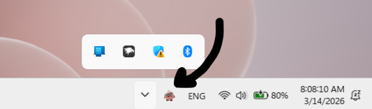
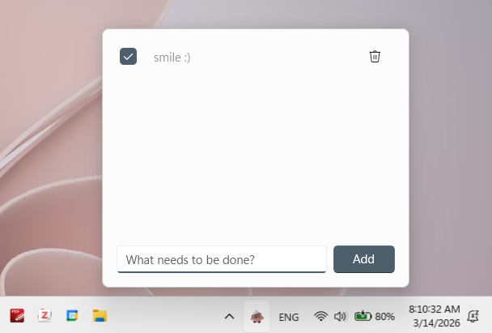

# <a href="https://github.com/rknastenka/Kyrios/releases" style="color:#a31c2c; text-decoration:none;">Windows To-Do-List System Tray App</a>

<a href="https://github.com/rknastenka/Kyrios/wiki" style="color:#a31c2c; text-decoration:none;">Help/Wiki</a>&nbsp; &nbsp; &nbsp; &nbsp; &nbsp;&nbsp; &nbsp; &nbsp; &nbsp; &nbsp;<a href="https://github.com/rknastenka/Kyrios?tab=readme-ov-file#installation" style="color:#a31c2c; text-decoration:none;">Install</a>&nbsp; &nbsp; &nbsp; &nbsp; &nbsp;&nbsp; &nbsp; &nbsp; &nbsp; &nbsp;<a href="https://rknastenka.github.io/Kyrios" style="color:#a31c2c; text-decoration:none;">Docs</a>&nbsp; &nbsp; &nbsp; &nbsp; &nbsp;&nbsp; &nbsp; &nbsp; &nbsp; &nbsp;<a href="" style="color:#a31c2c; text-decoration:none;">Contribute</a>&nbsp; &nbsp; &nbsp; &nbsp; &nbsp;&nbsp; &nbsp; &nbsp; &nbsp; &nbsp;<a href="https://ko-fi.com/rknastenka" style="color:#a31c2c; text-decoration:none;">Support</a>&nbsp; &nbsp; &nbsp; &nbsp; &nbsp;&nbsp; &nbsp; &nbsp; &nbsp; &nbsp;<a href="#" style="color:#a31c2c; text-decoration:none;">History</a>

<!-- [Docs](Code Overview/Architecture/Contributing Guidelines) -->

Kyrios is a lightweight Windows to-do list app that lives in your system tray. It lets you quickly add, manage, and track tasks without interrupting your workflow. Kyrios keeps your task list always within reach, just a click away from the taskbar. With a minimal, distraction-free interface, Kyrios stays out of your way so you can stay focused on what matters.

* — coming soon*

* — coming soon*

## Installation

1. Go to the [latest release](https://github.com/rknastenka/Kyrios/releases/latest)
2. Download **`Kyrios.cer`** and **`Kyrios_x64.msix`** -- <a href="https://github.com/rknastenka/Kyrios/releases/download/1.0.0/kyrios_1.0.0.0_x64.cer">certificate</a>, <a href="https://github.com/rknastenka/Kyrios/releases/download/1.0.0/kyrios_1.0.0.0_x64.msix">msix</a>
3. **Trust the certificate** *(one-time setup)*
   - Double-click `Kyrios.cer` → **Install Certificate**
   - Store Location: **Local Machine** → Next
   - Select **Place all certificates in the following store** → Browse → **Trusted People** → OK → Finish
4. Double-click **`Kyrios_x64.msix`** to install

> **Note:** The certificate only needs to be trusted once. Future updates can be installed directly.

## Basic Usage

 

1. Open Kyrios by clicking its icon in the system tray
2. Pin Kyrios to your taskbar
3. Add your tasks and start working.

---
