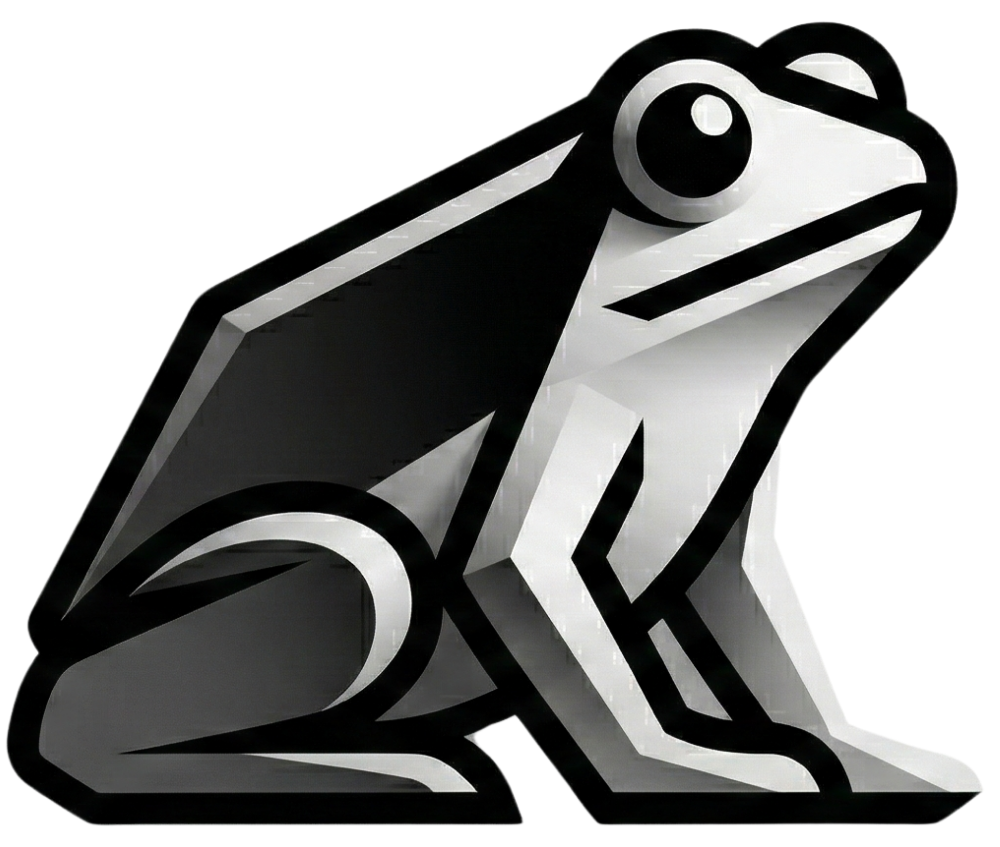
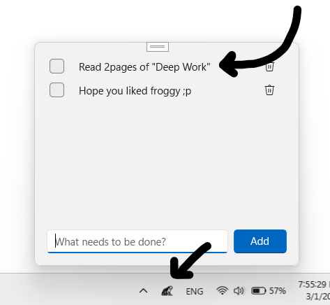

  

<h1 align="center"><strong>Froggy</strong></h1>
<h3 align="center">Minimal Windows-To-List</h3>

Just your tasks. Nothing else. 
A tiny tray app for Windows 11, no clutter, no distractions, no more set up and learning curves for more new apps.  
<strong>Click on the frog, Add your task, Be productive.</strong>

---

<table>
<tr>
<td width="50%" valign="top">

<h3>How to use it?</h3>

- Pin froggy in your taskbar.
- Click it, your task list pops up.
- Type a task, hit Enter or Add.
- Check it off when you're done, delete it if you don't need it.
- Closes itself when you click away, saves everything automatically.
- No install wizard, no account, no subscription.
</td>

<td width="50%" align="center">

</td>

</tr>
</table>

<!-- ### Debug & Run Locally

You'll need:
- Visual Studio
- Desktop development with C++
- Windows App SDK

Open WindToDo.slnx, set the platform to x64, and hit **F5**. -->
<table>
<tr>
<td width="50%" valign="top">

<h3>Contributing</h3>

Found a bug? Have a feature idea? Feel free to open an issue or send a pull request.

</td>

<td width="50%">

Some things that would be cool to add someday:
- Task categories as colors
- A light/dark theme toggle
- Keyboard shortcut to open froggy

</td>

</tr>
</table>

